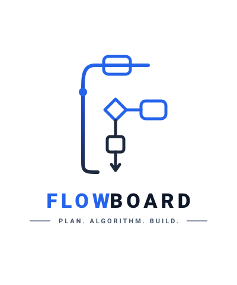

# ⚡ FlowBoard.ai

<p align="center">
  
</p>

<p align="center">
  <strong>Plan. Algorithm. Build.</strong><br/>
  An intelligent, AI-powered system architecture and visual flowchart canvas built with React, TypeScript, Tailwind CSS, Gemini AI, Firebase, and Express.
</p>

---

## 🌟 Overview

**FlowBoard.ai** is a next-generation interactive visual whiteboarding platform designed for developers, solution architects, and product engineering teams. It empowers users to map enterprise system architectures, design user onboarding flows, generate smart node diagrams using Google Gemini AI, collaborate in real time, and persist projects to Firestore or Supabase.

---

## ✨ Key Features

- **⚡ AI Diagram Generation**: Speak or prompt natural language architecture requirements to automatically generate styled nodes, connections, database schemas, and API gateways via Google Gemini 3.6 Flash.
- **🔐 Multi-Method Authentication**: Supports Google OAuth, Firebase Auth, and JWT validation with a glassmorphism login interface.
- **📁 Persistent Project Management**: Save, sync, and organize whiteboards securely in Firebase Firestore or Supabase PostgreSQL.
- **🎨 Rich Visual Canvas**: Interactive drag-and-drop nodes, diamond decision logic, API gateway blocks, relational table entity creators, sticky notes, and customizable connecting arrows.
- **☁️ Cloud & Workspace Integration**: Export and import whiteboard flows directly with Google Drive and Supabase.
- **💬 Real-Time Comments & Chat**: In-line node pin comments, collaborator chat threads, and live activity streams.
- **📄 Export & Share**: High-resolution PNG image exports, JSON project backup, and shareable preview links.

---

## 🛠️ Tech Stack

- **Frontend**: React 18, TypeScript, Vite, Tailwind CSS, Lucide React, Framer Motion
- **UI Components**: Radix UI, Shadcn UI primitives (`GlassCard`, `Button`, `Input`, `Label`)
- **Backend / API**: Node.js, Express, ESBuild CJS Bundler
- **AI Integration**: Google Gen AI SDK (`@google/genai`)
- **Database & Auth**: Firebase Firestore, Firebase Authentication, Supabase Client (`@supabase/supabase-js`)

---

## 🚀 Getting Started

### Prerequisites

- **Node.js**: v18 or higher
- **npm** or **pnpm** or **bun**

### 1. Clone the Repository

```bash
git clone https://github.com/your-username/flowboard-ai.git
cd flowboard-ai
```

### 2. Install Dependencies

```bash
npm install
```

### 3. Configure Environment Variables

Copy `.env.example` to create your local `.env` file:

```bash
cp .env.example .env
```

Populate `.env` with your API credentials:

```env
# Gemini AI Key
GEMINI_API_KEY=your_gemini_api_key_here

# Firebase Configuration
VITE_FIREBASE_API_KEY=your_firebase_api_key
VITE_FIREBASE_AUTH_DOMAIN=your_project.firebaseapp.com
VITE_FIREBASE_PROJECT_ID=your_project_id
VITE_FIREBASE_STORAGE_BUCKET=your_project.appspot.com
VITE_FIREBASE_MESSAGING_SENDER_ID=your_sender_id
VITE_FIREBASE_APP_ID=your_app_id
VITE_FIREBASE_FIRESTORE_DATABASE_ID=your_firestore_db_id

# Supabase Configuration
SUPABASE_URL=https://your-supabase-project.supabase.co
SUPABASE_ANON_KEY=your_supabase_anon_key
SUPABASE_SERVICE_ROLE_KEY=your_supabase_service_role_key
```

### 4. Run Development Server

```bash
npm run dev
```

The application will start on `http://localhost:3000`.

---

## 📦 Build & Production Deployment

To build the frontend and bundle the backend Express server:

```bash
npm run build
```

To run the production server:

```bash
npm start
```

---

## 📂 Project Structure

```
├── public/
│   ├── logo.svg              # Primary FlowBoard vector logo
│   └── logo-white.svg        # Light-on-dark FlowBoard logo
├── src/
│   ├── components/
│   │   ├── LoginPage.tsx      # Split-screen dark login screen
│   │   ├── Dashboard.tsx      # Project grid & whiteboard launcher
│   │   ├── Canvas.tsx         # Interactive whiteboard canvas
│   │   ├── Navbar.tsx         # Top navigation & action toolbar
│   │   ├── Sidebar.tsx        # Node shape drawer & AI generator
│   │   └── ui/                # Shadcn UI primitives (glass-card, button, input)
│   ├── lib/
│   │   ├── firebase.ts        # Firebase Auth & Firestore client
│   │   ├── supabase.ts        # Supabase client setup
│   │   └── utils.ts           # Tailwind class merge helper (cn)
│   ├── App.tsx                # Main app router & layout container
│   └── main.tsx               # Application entry point
├── components/ui/             # Standard root UI imports for Shadcn compatibility
├── server.ts                  # Express backend & Gemini API proxy
├── package.json
└── README.md
```

---

## 📜 License

Distributed under the MIT License. See `LICENSE` for details.

---

<p align="center">
  Crafted with ❤️ for developers by <strong>FlowBoard.ai</strong>
</p>
